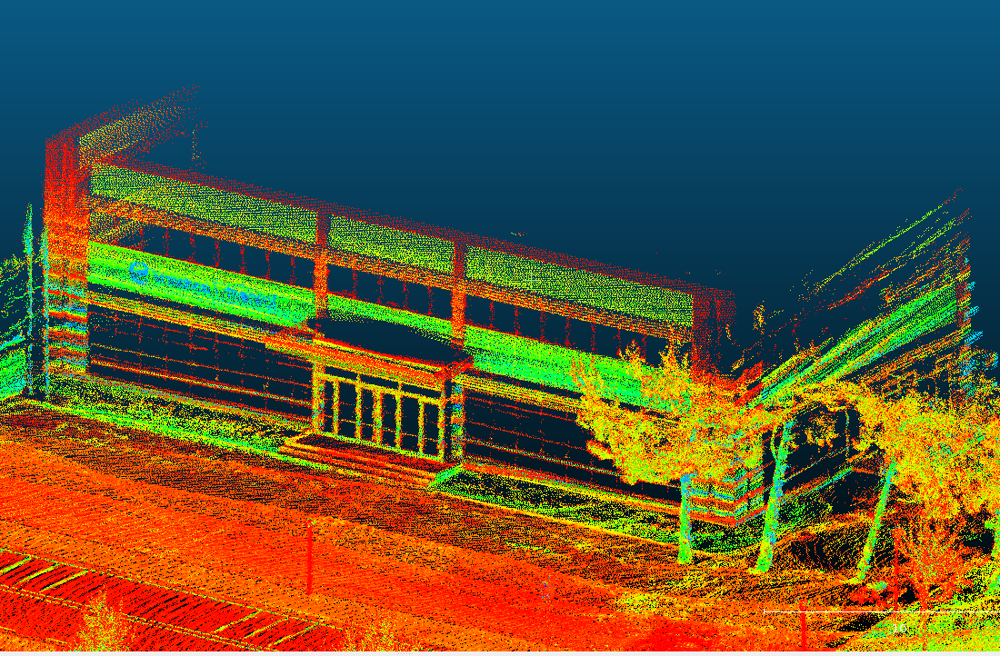
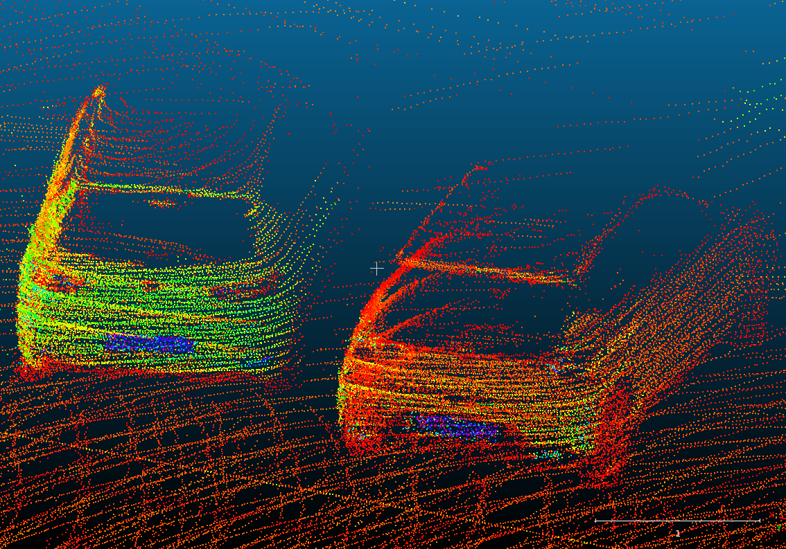
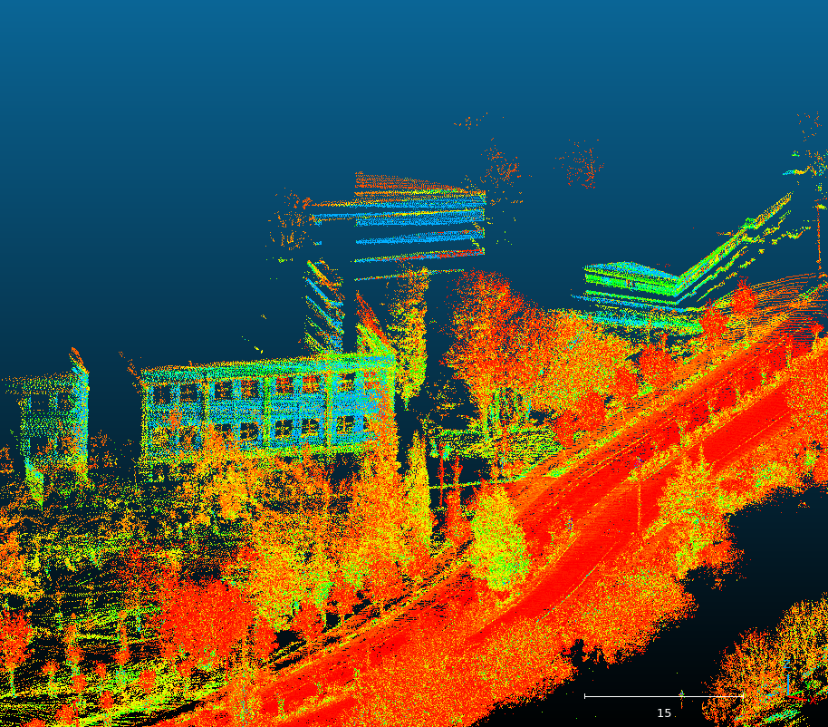
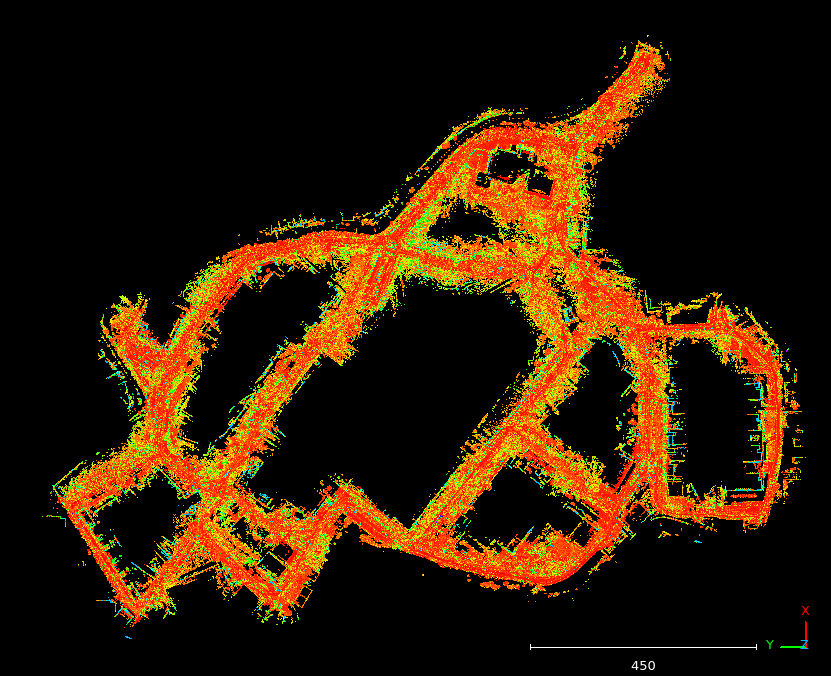
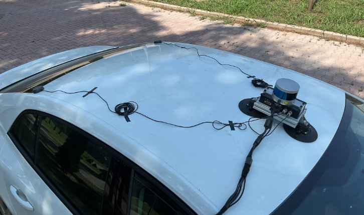
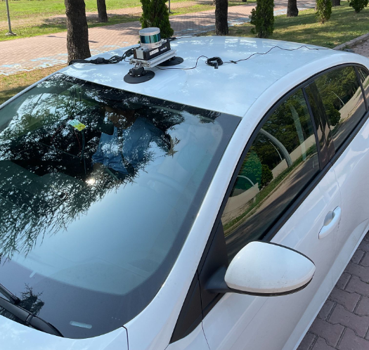

# Mapora
Mapora is an open-source georeferenced point cloud generating tool.
Basic idea is putting each individual point cloud onto the pose which are matched with time in nanosecond precision.

One of the important point for exporting tightly coupled point clouds with Mapora is having
high accurate GNSS/INS positions. To provide that, it is highly recommended to use a post-processing
software for GNSS/INS positions.

The other important issue is having precise LiDAR-IMU calibration angles. If not, the possibility of
having bad features in map is very high.


Some of the views of the point clouds can be seen below.

<p align='center'>
    
    
    
    
</p>


## Data Collection Procedure
For data collection, a Velodyne VLP16 and an Applanix PosLVX is needed.
These 2 sensors needed to be connected to each other with PPS cable. In that way,
the needed time information is provided into the VLP16.

Basically, the data can be collected with a Mobile Mapping System (MMS).
A sensor setup is needed for this procedure. With the system, fixed position sensors are provided.
A computer is able to collect PCAP for point cloud data comes from Velodyne VLP16 and GNSS/INS positions
comes from Applanix PosLVX via ethernet. Additionally, from the web user interface of the Applanix PosLVX
GNSS should be collected for post-processing the GNSS/INS positions to get better accuracy.
The example data collection is made with the car in below images.

<p align="center">
  
  
</p>


## System Requirements
- PC which runs Ubuntu 22.04 (Ubuntu version must be at least 20.04)
  - Mapora is tested on Ubuntu 22.04 with ROS2 Humble.


- Velodyne VLP16 LiDAR
  - One of the needed data are PCAPs which contain Velodyne VLP16 ethernet packets. These packets consist of
    data packets and position packages. Position packages is needed to transmit to the LiDAR with
    PPS (Pulse Per Second) and GPRMC messages. In that way, the time information that is needed
    for program provided in PCAPs.


- Applanix PosLVX GNSS/INS
  - The other needed data is GNSS position .txt data. These can be got in any way. Any software or
    library that can extract GNSS/INS positions in the read format of Mapora can be used.
  - One of the preferable way to get te GNSS/INS position .txt data is written below.
    - Collection the GNSS/INS data with RTK (Real Time Kinematics).
    - Post-Processing of the collected RTK GNSS/INS data for getting a better position accuracy.
    - Exporting the .txt files of GNSS/INS positions as Mapora can use. (An example of the
      format is provided in ```examples``` directory.)

## Dependencies

- [ROS2](https://docs.ros.org/en/humble/Installation.html) (At least ROS2 Foxy is needed)
- Eigen3
- Boost
- [libLAS](https://liblas.org/start.html#installation)
- [TBB](https://github.com/wjakob/tbb.git)
- [oneTBB](https://github.com/oneapi-src/oneTBB.git)
- [PcapPlusPlus](https://pcapplusplus.github.io/docs/install#build-from-source)

## Installation & Build

Create the ROS2 workspace:
```
mkdir -p <project_dir>/mapora_ws/src
cd <project_dir>/mapora_ws/src
```
Clone the Mapora repository:
```
git clone https://github.com/leo-drive/mapora.git
```

### Build on Your Local Computer
Install some dependencies with apt-get:
```
sudo apt-get install libgeotiff-dev libboost-all-dev libeigen3-dev libpcap-dev
```

Go to the ```mapora``` package directory and run build.sh script to install thirdparty libraries:
```
cd <project_dir>/mapora_ws/src/mapora
sudo ./scripts/build.sh
```

Install ROS2 dependencies:
```
sudo apt install ros-humble-point-cloud-msg-wrapper ros-humble-tf2-ros ros-humble-tf2
```

Build the ROS2 environment:
```
colcon build --symlink-install --cmake-args -DCMAKE_BUILD_TYPE=RelWithDebInfo -DCMAKE_EXPORT_COMPILE_COMMANDS=1
```

### Build with Docker
Go to ```docker``` directory inside the ```mapora``` package and build the docker image:
```
cd <project_dir>/mapora_ws/src/mapora/docker
docker image build -t mapora .
```
Go to the ```mapora``` package directory and create a container from the image with ```example_data``` directory:
Please don't forget to download the example data.
The example data is provided [below](https://github.com/leo-drive/mapora#example-data).
```
cd ..
docker run -it -v $(pwd)/example_data/:/root/mapora_ws/src/mapora/example_data mapora
```


## Input Files
| Input     | Description |
|-----------| ----------- |
| **PCAP Files**    | PCAP files are needed for reading the point clouds. |
| **Pose .txt** | Pose txt file is needed for reading the positions for knowing the point cloud origin positions. |

## Output Files
| Output               | Description |
|----------------------| ----------- |
| **Point Clouds**     | Georeferenced **.las** formatted point cloud files. |

## Run the Mapora
To running the Mapora, PCAP files collected with Velodyne VLP16 and GNSS poses taken from Applanix PosLVX are needed.
PCAP files can be seperated or can be only one piece. If it is one piece, then program may fail depending on your RAM size.
So, it is highly recommended to divide the PCAP files. It can be made with below command via Wireshark API.

### Run on Local Machine
```
editcap -c 1000 <input.pcap> <output.pcap>
```
It takes input PCAP and exports the seperated PCAP with file indexes like ```output_{index}_{timestamp}.pcap```.

After filling the ```params/mapora_params.yaml```, the program can be executed with:
```
ros2 launch mapora mapora_launch.py
```

### Run on Docker
Once you have builded the Docker image and the Docker container, you can get into the container with below command.
```
docker run -it -v $(pwd)/example_data/:/root/mapora_ws/src/mapora/example_data mapora
```
After that Mapora can be used.
```
ros2 launch mapora mapora_launch.py
```

## Example Data
To see how Mapora works, an example data directory is provided.
[This link](https://drive.google.com/drive/folders/1RuBxHYMV7cQG5IW_brsrCt3bjpDQ-Hcw?usp=drive_link) contains the example data of the Mapora.
The example data needs to be in the ```example_data/``` directory in the Mapora package.
In ```params/mapora_params.yaml``` file, the params are set to run the example data. You can observe the file paths in this file.
After you put all data files into right directory which is ```example_data/```, .las exports of the Mapora would be in
the ```example_data/output_las/``` directory.
```
ros2 launch mapora mapora_launch.py
```


## Params

| Param     | Description                                                                 |
|-----------|-----------------------------------------------------------------------------|
| project_namespace    | What is the name of this project for the point clouds that will be exported. |
| pcap_dir_path | Input directory of PCAPs.                                                   |
| pose_txt_path | Input file of pose txt.                                                     |
| las_export_directory | Export directory of the point clouds.                                       |
| max_point_distance_from_lidar | What is the maximum distance of LiDAR points for mapping?                   |
| min_point_distance_from_lidar | What is the minimum distance of LiDAR points for mapping?                   |
| r_x | LiDAR-IMU calibration **roll** angle (angle around X-axis).                 |
| r_y | LiDAR-IMU calibration **pitch** angle (angle around y-axis).                |
| r_z | LiDAR-IMU calibration **yaw** angle (angle around z-axis).                  |

