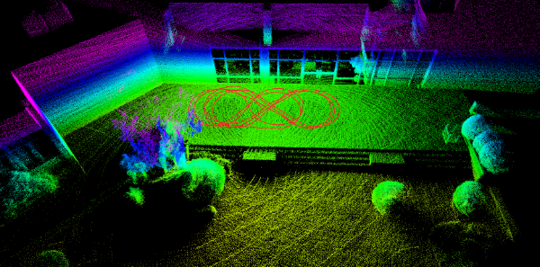

# LiDAR-IMU Calibration

LiDAR-IMU calibration is very important for Mapora and Mapora Rosbag. In GNSS/INS mapping, SLAM or any other
point registration method not used. In GNSS/INS mapping, the map is created with directly the GNSS/INS positions and
point clouds. Point clouds turned into correct direction with LiDAR-IMU calibration parameters. In that way, 
features in the map can be understood by human eye and computer programs.

## Data Collection Procedure for LiDAR - IMU Calibration
For LiDAR - IMU calibration, there is a need for a ROS1 bag file which contains `sensor_msgs/PointCloud2` and `sensor_msgs/Imu` messages. To obtain good results as a result of the calibration process, you need to move the sensors in all 6 axes (x, y, z, roll, pitch, yaw) while collecting data. Therefore, holding the sensors in your hand while data collection will get better results, but you can also collect data on the vehicle.

Moreover, the calibration accuracy is affected by the data collection environment. You should collect your data in a place that contains a lot of flat surfaces, and indoor spaces are the best locations under these conditions. However, you can also achieve good results outdoors. When collecting data, make sure to draw figures of eights and grids, capturing data from every angle

<p align="center">
  
</p>

### Converting ROS2 Bag File to ROS1 Bag File
If you collected your calibration data in ROS2, you can convert it to ROS1 bag file with the following instructions:

Split your ROS2 bag file if it contains non-standard message topics (you can only select `sensor_msgs/PointCloud2` and `sensor_msgs/Imu` messages), and convert your splitted ROS2 bag file to ROS1 bag.

1) Create a yaml file with name `out.yaml` which contains your lidar and imu topics:
```
output_bags:
- uri: splitted_bag
  topics: [/your/imu/topic, /your/pointcloud/topic]
```

2) Split your ROS2 bag file with the following command:
```shell
ros2 bag convert -i your_ros2_bag_folder -o out.yaml
```

3) Convert your splitted ROS2 bag file to ROS1 bag file:
```shell
# install bag converter tool (https://gitlab.com/ternaris/rosbags)
pip3 install rosbags

# convert bag
rosbags-convert your_splitted_ros2_bag_folder --dst output_bag_file
```


## LiDAR - IMU Calibration
When you are working with Mapora, you need to provide the calibration parameters of your LiDAR and IMU in `params/mapora_params.yaml`. We are providing a calibration tool as a thirdparty library developed by [APRIL LAB](https://github.com/APRIL-ZJU).

[The tool](https://github.com/leo-drive/OA-LICalib) which is used for calibration is developed with ROS1, and it depends on a lots of third party libraries. Because of that, we recommend you to use the docker image which is provided from us.

Firstly, you need to clone the calibration tool repository:
```shell
git clone https://github.com/leo-drive/OA-LICalib.git thirdparty/OA-LICalib
```

Then, you need to build the docker image:
```shell
cd thirdparty/OA-LICalib/docker
docker image build -t calib:v1 .
```

After that, you need to create a container from the image:
```shell
export REPO_PATH="<project_dir>/mapora_ws/src/mapora/thirdparty/OA-LICalib/"
docker run -it --env="DISPLAY" --volume="$HOME/.Xauthority:/root/.Xauthority:rw" --volume="/tmp/.X11-unix:/tmp/.X11-unix:rw" --volume="$REPO_PATH:/root/calib_ws/src/OA-LICalib" calib:v1 bash
```

Finally, you can install your ROS1 workspace and run the calibration tool:
```shell
cd catkin_oa_calib/
catkin_make -DCATKIN_WHITELIST_PACKAGES=""

source ./devel/setup.bash
roslaunch oa_licalib li_calib.launch
```