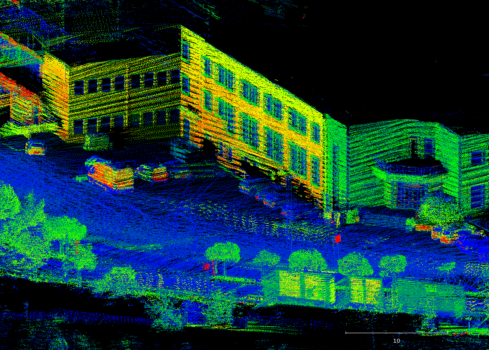
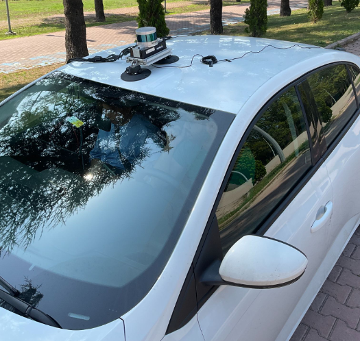

# Mapora Rosbag
Mapora Rosbag is an open-source georeferenced point cloud generating tool.
Basic idea is putting each individual point cloud onto the pose which are in the same line in the rosbag database.

One of the important point for exporting tightly coupled point clouds with Mapora Rosbag is having
high accurate GNSS/INS positions. To provide that, it is highly recommended to use RTK corrections while 
data collection.

The other important issue is having precise LiDAR-IMU calibration angles. If not, the possibility of
having bad features in map is very high.


Some of the views of the point clouds can be seen below.

<p align='center'>
    
    
    
</p>


## Data Collection Procedure
For data collection, A LiDAR and a GNSS/INS sensor which supports ROS2 is needed. 
The system works with rosbags and the data of the sensors are needed to be collected as rosbag in the same time.

Basically, the data can be collected with a Mobile Mapping System (MMS).
A sensor setup is needed for this procedure. With the system, fixed position sensors are provided.
A computer is able to collect rosbag is needed. After being sure all the data comes to the computer correctly, 
the rosbag can be started to record.

<p align="center">
  
  
</p>


## System Requirements
- PC which runs Ubuntu 22.04 (Ubuntu version must be at least 20.04)
    - Mapora Rosbag is tested on Ubuntu 22.04 with ROS2 Humble.


- A LiDAR which supports ROS2
    - One of the needed data are the point cloud comes from the LiDAR sensor. Mapora Rosbag works in ROS2.
    So, point clouds needed to be collected as a rosbag.


- A GNSS/INS which supports ROS2
    - The other needed data is GNSS position. It is highly recommended to use RTK corrections due to the need to
    increase of the accuracies of the GNSS/INS positions. 


## Installation & Build

Installation and building procedure is the same of the Mapora. You can find the instructions [here](mapora_readme.md#installation--build).

## Input Files
| Input                      | Description                                             |
|----------------------------|---------------------------------------------------------|
| **Collected Rosbag Files** | A rosbag file which includes GNSS/INS and LiDAR topics. |

## Output Files
| Output               | Description |
|----------------------| ----------- |
| **Point Clouds**     | Georeferenced **.las** formatted point cloud files. |

## Run the Mapora Rosbag
To running the Mapora Rosbag only a rosbag file is needed as input file. After filling the `/params/mapora_rosbag_params.yaml`
the tool is ready to run. 

> **WARNING:**
> 
> Please be aware that to use the point cloud distortion corrector in Mapora Rosbag, the point cloud data need to 
have a **timestamp** field. If not, please make the `correct_distortions: false` in mapora_params.yaml.

After building, at the environment directory:
```
source install/setup.bash
```
```
ros2 launch mapora mapora_rosbag.launch.py
```

## Example Data
To see how Mapora Rosbag works, an example data directory is provided.
[This link]() contains the example data of the Mapora Rosbag.
The example data needs to be in the ```example_data/mapora_rosbag/``` directory in the package.
In ```params/mapora_rosbag_params.yaml``` file, the params are set to run the example data. You can observe the file paths in this file.
After you put all data files into right directory which is ```example_data/mapora_rosbag/```, .las exports of the Mapora Rosbag would be in
the ```example_data/mapora_rosbag/output_las/``` directory.
```
ros2 launch mapora mapora_launch.py
```


## Params

| Param                               | Description                                                                  |
|-------------------------------------|------------------------------------------------------------------------------|
| project_namespace                   | What is the name of this project for the point clouds that will be exported. |
| las_export_directory                | Export directory of the point clouds.                                        |
| save_point_cloud_after_msgs         | Save point cloud after every (n) msgs.                                       |
| r_x                                 | LiDAR-IMU calibration **roll** angle (angle around X-axis).                  |
| r_y                                 | LiDAR-IMU calibration **pitch** angle (angle around y-axis).                 |
| r_z                                 | LiDAR-IMU calibration **yaw** angle (angle around z-axis).                   |
| t_x                                 | LiDAR-IMU calibration **X** distance.                                        |
| t_y                                 | LiDAR-IMU calibration **Y** distance.                                        |
| t_z                                 | LiDAR-IMU calibration **Z** distance.                                        |
| max_point_distance_from_lidar       | What is the maximum distance of LiDAR points for mapping?                    |
| min_point_distance_from_lidar       | What is the minimum distance of LiDAR points for mapping?                    |
| err_pos_x                           | Filter the GNSS/INS frames which have more than **X** error.                 |
| err_pos_y                           | Filter the GNSS/INS frames which have more than **Y** error.                 |
| err_pos_z                           | Filter the GNSS/INS frames which have more than **Z** error.                 |
| err_rot_x                           | Filter the GNSS/INS frames which have more than **roll** error.              |
| err_rot_y                           | Filter the GNSS/INS frames which have more than **pitch** error.             |
| err_rot_z                           | Filter the GNSS/INS frames which have more than **yaw** error.               |
| correct_distortions                 | Enable or disable point cloud distortion corrector.                          |
| base_link_tf_name                   | Name of the base link TF for point cloud distortion corrector.               |
| lidar_tf_name                       | Name of the LiDAR TF for point cloud distortion corrector.                   |
| point_cloud_timestamp_field         | The name of the timestamp field in the point cloud data.                     |
| rosbag_path                         | System path of the rosbag directory.                                         |
| point_cloud_topic                   | Name of the PointCloud2 topic.                                               |
| gnss_topic                          | Name of the NavSatFix topic.                                                 |
| imu_topic                           | Name of the Imu topic.                                                       |
| twist_with_covariance_stamped_topic | Name of the TwistWithCovarianceStamped Topic.                                |

